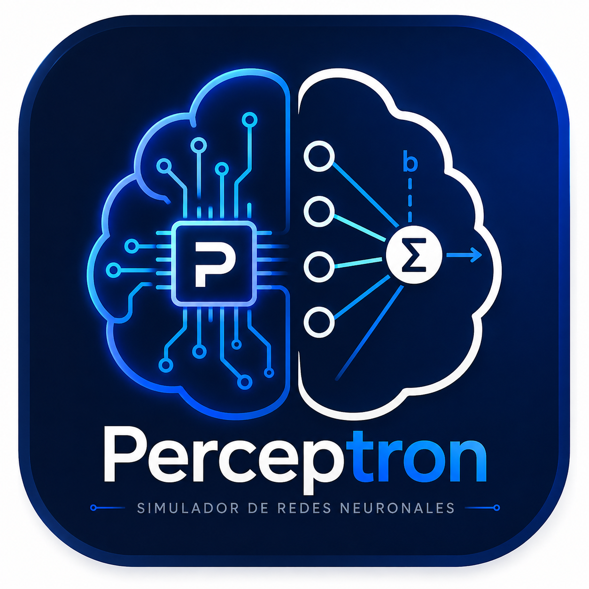
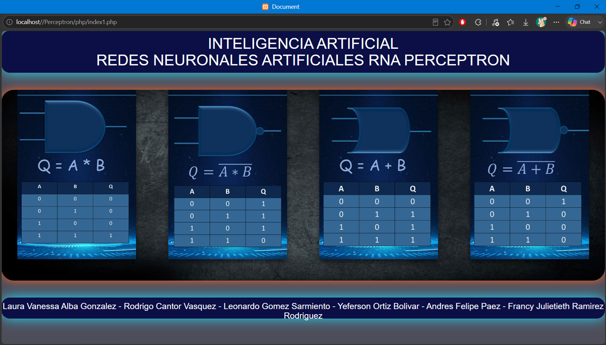

# Perceptron - Simulador Web de Redes Neuronales Artificiales (RNA) 


---

# 📖 Descripción

**Perceptron** es una aplicación web educativa desarrollada en **PHP** (procedural) que simula, en tiempo real y en el navegador, el entrenamiento de un **perceptrón simple (regla de aprendizaje de Rosenblatt)**.

El sistema permite seleccionar una compuerta lógica (**AND, NAND, OR, NOR**) y una cantidad de entradas (**2, 3 o 4**), y ejecuta el algoritmo de aprendizaje contra la tabla de verdad correspondiente, mostrando **fila por fila** cada iteración del proceso: pesos, umbral, salida calculada, error y ajustes. Una vez entrenado, el perceptrón puede verificarse con valores propios mediante una consulta **AJAX**, sin recargar la página.

Incluye además un módulo teórico-educativo con explicación paso a paso del algoritmo y un ejemplo con valores fijos para contrastar el cálculo manual con el resultado del sistema.

---

# 🖼️ Vista previa



---

# ✨ Características principales

- 🧠 Entrenamiento en vivo de un perceptrón simple, mostrando cada iteración del algoritmo en una tabla dinámica.
- 🔀 Soporte para 4 compuertas lógicas (AND, NAND, OR, NOR) con 2, 3 o 4 entradas (12 configuraciones distintas).
- 🎯 Verificación interactiva del perceptrón ya entrenado mediante un formulario con AJAX + jQuery.
- 📊 Panel visual del perceptrón: diagrama con entradas, pesos, umbral y función de activación superpuestos sobre una imagen de referencia.
- 📚 Módulo educativo con explicación teórica de 14 pasos y video incluido.
- 🧮 Ejemplo comparativo con valores fijos (pesos, umbral y coeficiente de aprendizaje predefinidos) para verificar el cálculo a mano.
- 💾 Persistencia de pesos y umbral entrenados mediante sesiones de PHP (`$_SESSION`), reutilizados por el módulo de verificación AJAX.

---

# 📂 Estructura del proyecto

```
Perceptron/
│
├── css/                             # Estilos de cada vista (una hoja por compuerta/tamaño)
│   ├── index1.css
│   ├── compuerta_and_2_b.css
│   ├── compuerta_and3.css / and4.css
│   ├── compuerta_nand_2_a.css / nand_3.css / nand4.css
│   ├── compuerta_or_2.css / or_3.css / or_4.css
│   ├── compuerta_nor_2.css / nor_3.css / nor_4.css
│   ├── explicacion4.css
│   └── prueba_and_a.css
│
├── imagenes/                        # Imágenes de compuertas, tablas de verdad y diagrama del perceptrón
│   ├── compuerta_and.png, compuerta_nand.png, compuerta_or.png, compuerta_nor.png (+ variantes 3/4 entradas)
│   ├── tabla_and.png, tabla_nand.png, tabla_or.png, tabla_nor.png (+ variantes)
│   ├── perceptron3.png              # Diagrama base del perceptrón
│   └── ...material de apoyo (pptx, pdf, fondos)
│
├── explicacion/
│   └── explicacion.mp4              # Video explicativo del algoritmo
│
└── php/
    ├── index1.php                   # Página principal: presentación de las 4 compuertas
    ├── explicacion.php              # Explicación teórica paso a paso (14 pasos) + video
    ├── prueba.php                   # Ejemplo con valores fijos para comprobar el cálculo manual
    │
    ├── compuerta_and2.php / and3.php / and4.php     # Entrenamiento + vista AND (2/3/4 entradas)
    ├── compuerta_nand2.php / nand3.php / nand4.php  # Entrenamiento + vista NAND
    ├── compuerta_or2.php / or3.php / or4.php        # Entrenamiento + vista OR
    ├── compuerta_nor2.php / nor3.php / nor4.php     # Entrenamiento + vista NOR
    │
    └── ajaxand2.php / ajaxand3.php / ajaxand4.php   # Endpoints AJAX de verificación (2/3/4 entradas)
```

---

# 💻 Tecnologías utilizadas

## Backend
- PHP (procedural)
- Sesiones de PHP (`$_SESSION`) como mecanismo de persistencia del estado entrenado
- Sin base de datos: los patrones de entrada/salida están definidos directamente en el código

## Frontend
- HTML5
- CSS3 (posicionamiento absoluto para el diagrama del perceptrón)
- JavaScript
- AJAX
- jQuery
- Bootstrap 3 (modales, grillas y componentes)

## Arquitectura
- PHP procedural, un archivo independiente por cada combinación de compuerta lógica y número de entradas (no implementa MVC ni un motor de reglas parametrizado)

---

# ⚙️ Funcionalidades del sistema

- ✔ Selección de compuerta lógica (AND, NAND, OR, NOR) y cantidad de entradas (2, 3, 4) desde la página principal.
- ✔ Entrenamiento automático del perceptrón contra la tabla de verdad seleccionada, con pesos, umbral y coeficiente de aprendizaje inicializados aleatoriamente.
- ✔ Renderizado en tabla de cada iteración del algoritmo (patrón, entradas, pesos, ∅, D, y, F(x), ⴄ, δ, Δ1, Δ2, pesos actualizados, número de iteración).
- ✔ Verificación del perceptrón entrenado con valores propios mediante AJAX (`ajaxandN.php`), validando que las entradas sean binarias (0 o 1).
- ✔ Botones de recálculo (nuevo entrenamiento con pesos aleatorios) y cambio de compuerta/número de entradas.
- ✔ Módulo teórico con explicación paso a paso del algoritmo y ejemplo numérico fijo para comprobación manual.

---

# ⚙️ Requisitos

- PHP 7.4 o superior.
- Servidor Apache (XAMPP, WAMP o Laragon).
- Navegador web moderno con soporte para JavaScript habilitado.

> No se requiere base de datos ni gestor de dependencias: el proyecto no usa MySQL ni Composer.

---

# 🚀 Instalación

## 1. Clonar el repositorio
```
git clone https://github.com/rcvunicun-lgtm/Perceptron.git
```

## 2. Configurar servidor local
Copiar la carpeta del proyecto dentro del directorio raíz de tu servidor web local.
Ejemplo utilizando XAMPP: `D:/Instalados/Xampp/htdocs/Perceptron`

## 3. Ejecutar la aplicación
Abre tu navegador web e ingresa a la siguiente ruta:
```
http://localhost/Perceptron/php/index1.php
```

No requiere configuración adicional de base de datos ni variables de entorno: cada carga de página genera y entrena el perceptrón de forma independiente.

---

# 🧠 Arquitectura del proyecto

El sistema no implementa un patrón MVC; sigue una organización de PHP procedural en la que cada compuerta lógica y número de entradas tiene su propio archivo autocontenido (entrenamiento + vista).

```
Usuario ──> index1.php ──> selección de compuerta/entradas ──> compuerta_XXXX.php
                                                                     │
                                                    (entrena el perceptrón y guarda
                                                     pesos/umbral en $_SESSION)
                                                                     │
                                                                     ▼
                                                  Formulario de verificación (AJAX/jQuery)
                                                                     │
                                                                     ▼
                                                            ajaxandN.php ──> respuesta (0/1)
```

---

# 🔢 Proceso matemático del algoritmo

Esta es la base matemática que se programó en cada archivo `compuerta_*.php`. Los símbolos coinciden exactamente con las columnas que se imprimen en la tabla de entrenamiento (∅, D, y, F(x), ⴄ, δ, Δ1, Δ2...), para que el código y la teoría se puedan leer en paralelo.

**1. Definir la tabla de verdad**
Se establece el orden de los patrones y su salida esperada `D` según la compuerta elegida (AND, NAND, OR o NOR).

**2. Tomar las entradas del patrón actual**
`X1, X2 (..., Xn)` según el número de entradas seleccionado (2, 3 o 4).

**3. Inicializar los pesos**
`p1, p2 (..., pn)` con valores aleatorios entre -1 y 1. *(Solo en la primera iteración del entrenamiento.)*

**4. Inicializar el umbral**
`∅` con un valor aleatorio entre -1 y 1. *(Solo en la primera iteración.)*

**5. Tomar la salida esperada**
`D` correspondiente al patrón actual, según la tabla de verdad.

**6. Calcular la suma ponderada**
```
y = (p1·X1 + p2·X2 + ... + pn·Xn) − ∅
```

**7. Aplicar la función de activación (escalón)**
```
F(x) = 1   si y ≥ 0
F(x) = 0   si y < 0
```

**8. Inicializar el coeficiente de aprendizaje**
`ⴄ` con un valor aleatorio entre 0 y 1. *(Solo en la primera iteración; se mantiene fijo durante todo el entrenamiento.)*

**9. Calcular el error**
```
δ = D − F(x)
```

**10. Calcular la variación de cada peso**
```
Δ1 = ⴄ · δ · X1
Δ2 = ⴄ · δ · X2
...
Δn = ⴄ · δ · Xn
```

**11. Actualizar los pesos**
```
p1+ = p1 + Δ1
p2+ = p2 + Δ2
...
```

**12. Actualizar el umbral**
```
∅+ = ∅ − (ⴄ · δ)
```

**13. Evaluar el error y decidir el siguiente paso**
- Si `δ = 0` → los pesos **no** cambian; el algoritmo avanza al siguiente patrón de la tabla.
- Si `δ ≠ 0` → se aplican los nuevos pesos (`p1+`, `p2+`) y el nuevo umbral (`∅+`), y el entrenamiento **se reinicia desde el primer patrón** con estos valores actualizados.

**14. Repetir hasta converger**
El proceso se repite hasta que los cuatro (u ocho o dieciséis, según el número de entradas) patrones se clasifiquen correctamente en una misma pasada (`δ = 0` en todos). El número de vueltas necesarias queda registrado como "iteraciones" al final de la tabla.

### Pseudocódigo equivalente (así quedó implementado en PHP)

```
fila = 0
mientras fila < total_de_patrones:
    (x1, x2, ..., xn, D) = patrón[fila]
    y = (p1*x1 + p2*x2 + ... + pn*xn) - ∅
    F(x) = 1 si y >= 0, si no F(x) = 0
    δ = D - F(x)

    si δ == 0:
        fila = fila + 1                 # patrón correcto, avanzar
    si no:
        Δi = ⴄ * δ * xi   (para cada peso)
        pi = pi + Δi
        ∅  = ∅ - (ⴄ * δ)
        fila = 0                        # error: reiniciar desde el patrón 1
```

Una vez que el `while` termina (todos los patrones clasificados correctamente), los valores finales de `p1, p2 (..., pn)` y `∅` quedan guardados en `$_SESSION` y son los que usa `ajaxandN.php` para responder cuando el usuario prueba valores propios en el formulario de verificación (paso 6 y 7 aplicados directamente, sin entrenamiento adicional).

---

# 🎯 Objetivos del proyecto

- Ilustrar de forma visual y didáctica el funcionamiento interno de un perceptrón simple.
- Facilitar la comprensión de la regla de aprendizaje de Rosenblatt mostrando cada iteración del proceso.
- Permitir la comparación entre el cálculo manual (módulo teórico) y el resultado automatizado del sistema.
- Servir como material de apoyo práctico para la asignatura de Inteligencia Artificial / Redes Neuronales Artificiales.

---

# 🧠 Conocimientos aplicados

Durante el desarrollo de este proyecto se consolidaron competencias en:
- Implementación de algoritmos de aprendizaje supervisado (perceptrón) en un lenguaje de backend.
- Desarrollo backend estructurado con PHP procedural.
- Manejo de estado entre peticiones mediante sesiones de PHP (`$_SESSION`).
- Comunicación asíncrona cliente-servidor mediante AJAX y jQuery.
- Maquetación e interfaces con Bootstrap y posicionamiento CSS para diagramas visuales.
- Traducción de un algoritmo matemático (regla delta del perceptrón) a lógica de programación paso a paso.

---

# 🚀 Mejoras futuras

- Unificar los 12 archivos `compuerta_*.php` en un único módulo parametrizado por compuerta y número de entradas, evitando la duplicación de código.
- Corregir el caso límite en que el coeficiente de aprendizaje aleatorio (`$ca`) puede generarse en 0, lo que puede provocar que el entrenamiento no converja.
- Añadir un límite máximo de iteraciones como medida de seguridad ante configuraciones que tarden en converger.
- Migrar las dependencias externas (jQuery, Bootstrap) de CDN por `http://` a `https://`.
- Externalizar los patrones de entrada/salida a un archivo de configuración en lugar de tenerlos codificados en cada vista.

---

# 👨‍💻 Autor(es)

Proyecto desarrollado como trabajo académico para la asignatura de Inteligencia Artificial:

RODRIGO CANTOR VASQUEZ - Desarrollador de Software
GitHub: https://github.com/rcvunicun-lgtm

**Colaboradores del proyecto original:**
Laura Vanessa Alba Gonzalez · Rodrigo Cantor Vasquez · Leonardo Gomez Sarmiento · Yeferson Ortiz Bolivar · Andres Felipe Paez · Francy Julietieth Ramirez Rodriguez

---

# ⭐ Si este proyecto te resulta útil...

No olvides regalarle una ⭐ al repositorio en GitHub.